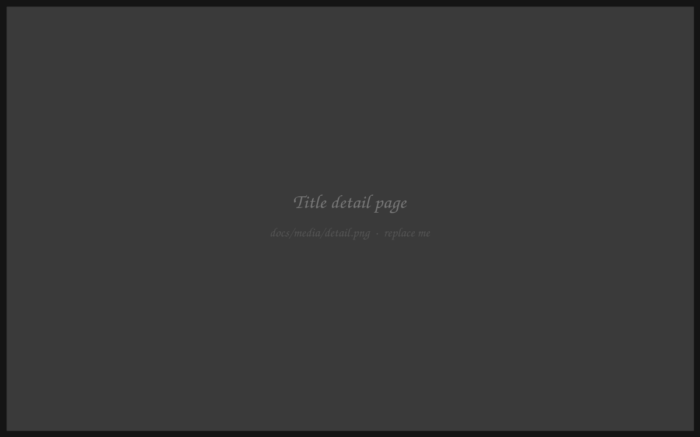
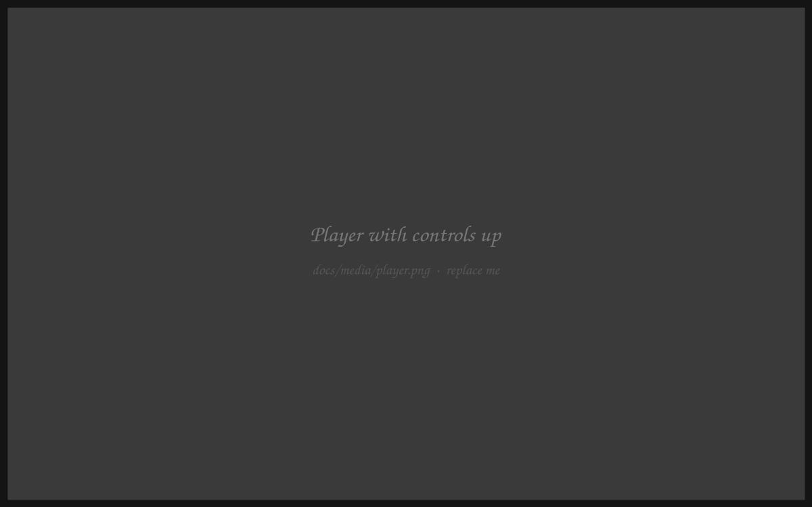
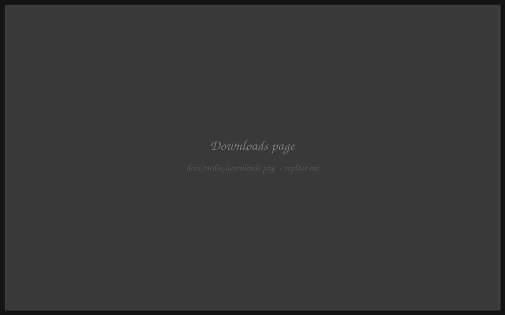
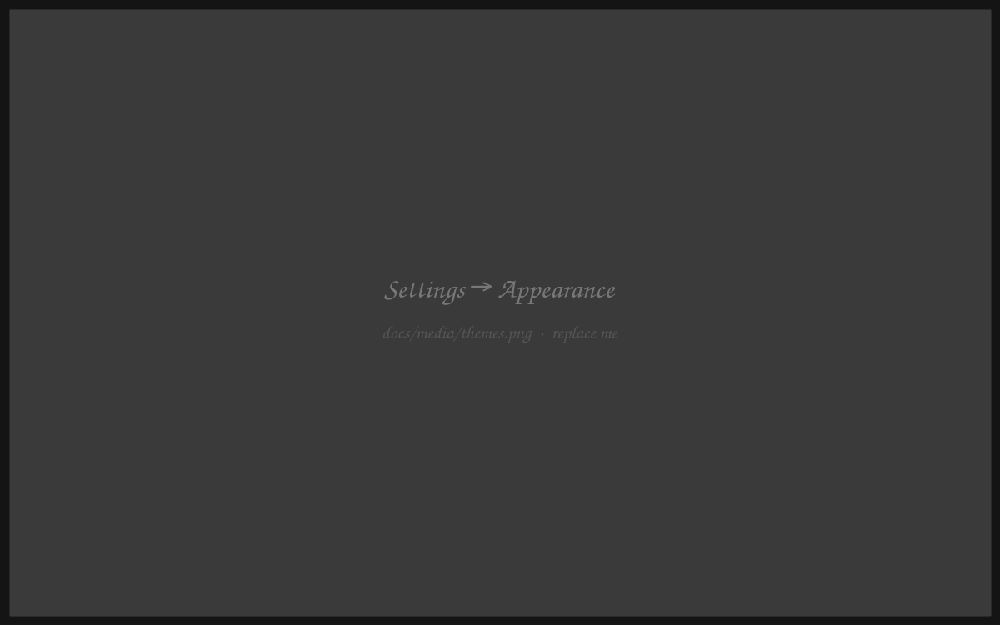
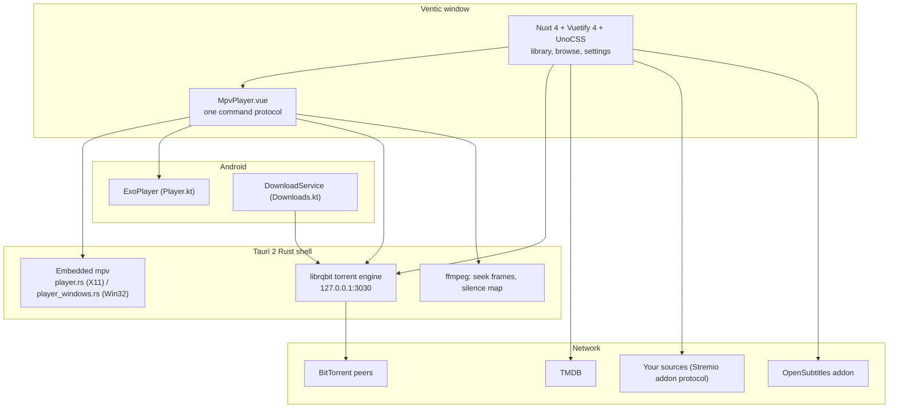

<div align="center">
<a name="readme-top"></a>


# Ventic

<h3>A media library and BitTorrent player for the desktop and Android TV</h3>

Keeps track of what you're watching, and plays torrents in a real mpv window rather than a
browser `<video>` tag — so half-downloaded MKVs, HEVC, AV1 and DTS all just play. Built with
Nuxt and Tauri, driven as happily by a TV remote as by a mouse.

<br/>

[![Version][badge-version]][releases] &nbsp;
[![License][badge-license]][license] &nbsp;
[![Tauri][badge-tauri]][tauri] &nbsp;
[![Nuxt][badge-nuxt]][nuxt] &nbsp;
[![Engine][badge-engine]][librqbit] &nbsp;
[![Platforms][badge-platforms]][releases]

<br/>

<a href="https://ko-fi.com/ventictv"></a>

<br/>

[Why Ventic](#why-ventic) &middot; [Features](#feature-tour) &middot; [Sources](#sources) &middot;
[Install](#install) &middot; [Build](#build-from-source) &middot; [Architecture](#architecture) &middot;
[FAQ](#faq) &middot; [Contributing](#contributing)

</div>

<br/>

https://github.com/user-attachments/assets/2d0bd58f-c838-43e2-a0ce-e503f9317aa8

<p align="center">
  <sub><b>One minute, end to end</b> &middot; browsing, themes and backgrounds, then a torrent
  playing in the embedded mpv window with the subtitle menu open.</sub>
</p>

> [!IMPORTANT]
> **Ventic hosts no content and indexes no content.** It ships with **no sources**, searches
> nothing on its own, and will not suggest anywhere to look. A source is a URL *you* add — see
> [Sources](#sources). With none configured, Ventic is a general-purpose torrent client with a
> very good player attached.

<br/>

<details>
<summary><kbd>Table of contents</kbd></summary>

<br/>

- [Why Ventic](#why-ventic)
- [Feature Tour](#feature-tour)
  - [Rooms and views](#rooms-and-views)
  - [The player](#the-player)
  - [Playback and codecs](#playback-and-codecs)
  - [Downloads](#downloads)
  - [Subtitles](#subtitles)
  - [Themes and appearance](#themes-and-appearance)
  - [Built for a remote](#built-for-a-remote)
- [Sources](#sources)
  - [Adding a source by link](#adding-a-source-by-link)
- [Your library](#your-library)
- [Privacy](#privacy)
- [Install](#install)
  - [Opening it on macOS](#opening-it-on-macos)
- [Configuration](#configuration)
- [Build from source](#build-from-source)
- [Architecture](#architecture)
- [Tests](#tests)
- [FAQ](#faq)
- [Contributing](#contributing)
- [Legal](#legal)
- [Acknowledgements](#acknowledgements)
- [License](#license)

</details>

<br/>

## Why Ventic

Most torrent-backed players are a browser `<video>` tag in a trench coat, and the codec support
shows. Ventic embeds the real thing and keeps the library around it honest and local.

- **A real mpv window, not a video tag.** On Linux and Windows the Rust side parents an actual
  mpv window into the page and keeps it glued to a box in the layout. mpv carries its own
  ffmpeg, so HEVC, AV1, 10-bit, E-AC-3, DTS and half-downloaded MKVs play with no codec packs.
- **The engine is in the app.** [librqbit][librqbit] runs in-process — a full downloads UI with
  file pickers, seeding, speed limits and a disk budget, not a hidden cache.
- **Streaming while it downloads.** Playback starts on the first bytes; already-downloaded
  titles replay with no TMDB lookup, no source search and no peers.
- **One player, three backends.** Where mpv can't be embedded, ExoPlayer (Android) or the
  webview's `<video>` answers the *same* command protocol, so there is one player component and
  one set of controls rather than three.
- **Your library stays yours.** History, progress, favourites and the watchlist live in this
  device's storage. No Ventic account, no Ventic server, no sync — one file carries the lot.
- **Usable from the sofa.** Full d-pad navigation, focus-first styling and an Android TV build —
  a remote reaches everything a mouse does.
- **No sources, ever.** The empty source list is a deliberate feature, not an oversight. It is
  the whole reason this project can be published.

<p align="right"><a href="#readme-top">&#9650; back to top</a></p>

## Feature Tour

<table>
<tr>
<td width="33%" valign="top">

**Browse and track**

Home, Movies, TV, Anime, Search, plus Favourites, Watchlist and History. TMDB metadata
throughout — posters, backdrops, cast, ratings, per-episode watched state and resume points.

</td>
<td width="33%" valign="top">

**Play anything**

Embedded mpv on the desktop, ExoPlayer on Android, `<video>` everywhere else. Subtitle search
with audio auto-sync, seek-preview thumbnails, audio and subtitle track menus, speed control.

</td>
<td width="33%" valign="top">

**Own the pipes**

An in-process BitTorrent engine with a real downloads page: magnets, `.torrent` files, file
selection, seeding, speed limits, a disk budget that evicts oldest-watched first, and a
Wi-Fi-only switch.

</td>
</tr>
</table>

<table>
<tr>
<td width="50%" align="center">
<br/>
<sub><b>Detail</b> &middot; backdrop, cast, ratings, seasons and episodes, with resume points and
watched ticks per episode.</sub>
</td>
<td width="50%" align="center">
<br/>
<sub><b>Player</b> &middot; embedded mpv with seek-preview frames, track menus and subtitle styling
that previews live.</sub>
</td>
</tr>
<tr>
<td width="50%" align="center">
<br/>
<sub><b>Downloads</b> &middot; the torrent engine's own UI — per-file selection, seeding, speed
limits, disk budget.</sub>
</td>
<td width="50%" align="center">
<br/>
<sub><b>Appearance</b> &middot; a palette generated from any colour, 26 presets,
poster size, app scale and a global CSS box.</sub>
</td>
</tr>
</table>

<br/>

### Rooms and views

| Room | What you get |
| --- | --- |
| **Home** | Continue watching, Trending today, Popular movies and shows, Top rated, In cinemas |
| **Movies** / **TV** / **Anime** | Browse rows with grid or list layout, remembered per session |
| **Search** | One box across TMDB; results carry straight through to a source search |
| **Favourites** / **Watchlist** / **History** | The three local lists |
| **Detail** | Backdrop, synopsis, cast, trailer, seasons and episodes with per-episode state |
| **Downloads** | The engine's UI — add, pick files, pause, seed, limit, evict |
| **Settings** | Appearance, Sources, Subtitles, Network, Storage, Account, Support, About |

<p align="right"><a href="#readme-top">&#9650; back to top</a></p>

### The player

One component, one set of controls, three backends underneath.

| Capability | Detail |
| --- | --- |
| **Backends** | Embedded mpv (Linux, Windows, macOS), ExoPlayer (Android), webview `<video>` (browser) — all answering the same command/property protocol |
| **Start early** | Playback begins on the first bytes; the engine is polled for a real byte before mpv launches, so a fresh torrent never opens a black box |
| **Seek preview** | Frames pulled with ffmpeg and cached, warmed only while the control bar is up |
| **Tracks** | The file's own audio and subtitle tracks, the release's subtitle files, and OpenSubtitles — in one menu |
| **Subtitle styling** | Font, size, colour, outline, position, applied to mpv and to the page-drawn cues alike, previewing live from Settings |
| **Auto-sync** | A file cut for another release is slid onto the audio's silence map (desktop only — it needs ffmpeg, which Windows bundles) |
| **Resume** | Progress recorded as it plays, per episode, and picked back up from the card or the detail page |
| **Fullscreen** | Held for as long as the player is mounted; Android goes landscape and immersive |

The native mpv surface paints *above* the webview, so the controls can't just be stacked over it
in CSS. Every overlay marks itself, its rectangle is measured each frame, and the Rust side
subtracts it from mpv's window with the X Shape extension — the page shows through the holes,
clicks included, while the video window itself never resizes.

<p align="right"><a href="#readme-top">&#9650; back to top</a></p>

### Playback and codecs

| Platform | Backend | Notes |
| --- | --- | --- |
| Linux | mpv | Needs `mpv` and `ffmpeg` on PATH |
| Windows | mpv | Ships its own `mpv.exe` and `ffmpeg.exe` — nothing to install |
| Android phone / TV | ExoPlayer | The device's own decoders; landscape and immersive while playing |
| macOS | mpv | Ships its own libmpv, linked rather than launched; see below. Seek previews and auto-sync want `brew install ffmpeg` — an .app launched from Finder inherits no shell PATH, so Homebrew's own prefixes are checked directly |
| `bun run dev` in a browser | `<video>` | Which is what makes the mobile player testable without a device |

- **mpv plays everything**, and needs none of the rest of this section.
- **macOS gets there a different way.** The platform embeds no other process's window, and mpv's
  Cocoa output takes no `--wid` — the manual offers it for X11, win32 and Android only. So mpv is
  not a process there: the app links libmpv, asks for `vo=libmpv`, and draws the frames itself
  into an OpenGL view *under* the webview, with the page made see-through down to the video box.
  Same picture in the same place, same controls, same IPC protocol underneath.
- **ExoPlayer plays what the device has.** A TV box: Dolby (AC-3, E-AC-3/DDP), HEVC, usually AV1.
  A mid-range phone: often none of those, because Dolby is licensed per device. DTS and TrueHD
  are rare on both — they need Media3's FFmpeg extension, an NDK build that isn't bundled here.
- **`<video>` is the narrow one.** Chromium is built with Dolby and DTS off whatever the hardware
  can do, so a release carrying one plays as a picture with no sound. **x264 + AAC always plays.**
  It also offers only external subtitles and no audio-track menu, because Chromium's demuxer
  keeps the file's own tracks to itself.
- **Ranking asks the device rather than guessing.** `isAwkward` in `app/utils/torrents.ts` reads a
  release name for the codecs it claims, then puts each to `MediaCodecList` (Android) or
  `MediaSource.isTypeSupported` (a webview). `pickBest` breaks a tie towards what came back, but
  never at the cost of a quality tier — so a TV keeps the Dolby copy it can play, and a phone
  that can't is steered off it.

Failures name the likely cause instead of showing a black rectangle.

<p align="right"><a href="#readme-top">&#9650; back to top</a></p>

### Downloads

The engine runs inside the app process, which has consequences worth knowing.

| | |
| --- | --- |
| **Adding** | A magnet, a `.torrent` file, or a release picked from a source |
| **Files** | Pick what to fetch inside a torrent; season packs download the one episode |
| **Seeding** | On by default, with upload and download limits |
| **Disk budget** | Oldest-watched evicted first when the cache limit is reached; nothing playing is ever touched |
| **Wi-Fi only** | Pauses background torrents on a metered connection and restarts exactly the ones it paused — never one you paused, never the film being watched |
| **Android** | A foreground service keeps the process alive while something is downloading; without it, "the user opened another app" means "the download stopped" |

<p align="right"><a href="#readme-top">&#9650; back to top</a></p>

### Subtitles

Files that came inside the torrent are offered first — they're already on disk, already cut to
that release, and work with no network at all. Otherwise the OpenSubtitles list comes from
Stremio's public addon, so there's no API key in the app and no quota to hit; any source you
configured is asked too, since one addon base answers `/subtitles/` and `/stream/` alike.

That listing carries a URL and a language and nothing else — no release name, no
hearing-impaired flag, and it matches on the IMDb id alone, which is why a list of forty files
for one film holds so many that were never cut for the copy you are playing. So the files
themselves are read: each candidate is downloaded and parsed, and the menu says how long it
runs, how many lines it has and whether it is the captioned cut. One that plainly doesn't cover
this video's runtime — another episode, an extended cut, a different film after a bad title
match — sorts last and says so. Where a provider does name a file, that name is what you see.
The chosen language is remembered for the next episode, and where mpv isn't drawing the cues the
page draws them with the same font, size and colour settings.

Auto-sync slides a mismatched file over the audio's silence map — the trick ffsubsync uses,
minus the FFT — and reports its own confidence rather than silently applying a bad shift.

<p align="right"><a href="#readme-top">&#9650; back to top</a></p>

### Themes and appearance

**Your colour** builds a whole Material Design 3 palette out of one colour — pick it off the
spectrum slider or the picker, flip dark or light, and every role from `primary-container` to
`on-tertiary-fixed-variant` is derived with Google's own generator
(`@material/material-color-utilities`, the engine behind Material Theme Builder).

There are 26 presets beside it, dark and light — Ventic Dark, Midnight (OLED), Carbon, Monochrome,
Nord, Tokyo Night, Mocha, Dracula, Rosé Pine, Gruvbox, Monokai, Solarized, Ember, Forest, Abyss,
Crimson, Amethyst, Ventic Light, Paper, Latte, Frost, Mint and more: each is that same generated
palette with the surfaces it is recognisable by laid back on top, and every foreground/background
pair's contrast is asserted in `bun run check:theme` rather than eyeballed.

A theme is a preset rather than only a palette: it can carry the background it was drawn for —
poster art, a picture, or none of it, with its own blur and tint — and picking it lays that down
too. Anything it doesn't name is left as you had it. All of them live in one table
(`app/theme/presets.ts`), and an entry there is a theme everywhere.

*Settings → Appearance* is three tabs: **Theme** (the grid, filtered to dark or light),
**Background** (what sits behind the app, and how blurred), and **Display** (app scale, poster
size, the performance switch and a global CSS box).

<p align="right"><a href="#readme-top">&#9650; back to top</a></p>

### Built for a remote

The app is driven by up, down, left, right, OK and back as often as by a mouse. That is a
constraint on every screen, not a mode: real `<a>`/`<button>` elements throughout, a `focus`
style anywhere there's a `hover` style, decorative overlay buttons taken out of the tab order,
and nothing that depends on typing or pointing. Spatial navigation is handled centrally in
`app/plugins/dpad.client.ts`, and its focus geometry has a check beside it (`bun run check:dpad`)
— which also holds the BACK contract, where the page gets first refusal on every Android version
and back at the root backgrounds the app rather than closing it.

<p align="right"><a href="#readme-top">&#9650; back to top</a></p>

## Sources

Ventic can search for a title if you tell it where to look. **It does not come with anywhere to
look, and it will not suggest one.**

A **source** is a URL you add under *Settings → Sources*, pointing at a server that speaks the
[Stremio addon protocol][stremio-sdk]:

```
GET  {source}/stream/movie/{imdbId}.json
GET  {source}/stream/series/{imdbId}:{season}:{episode}.json
→    { "streams": [ { "infoHash": "…", "title": "…", "name": "…" }, … ] }
```

That's the whole integration. Ventic runs no code from a source — it reads the JSON, ranks the
results and hands the one you pick to its own torrent engine. Add several and their results
merge, duplicates dropped, earlier sources preferred.

A stream can name a `url` instead of an `infoHash`, and Ventic plays that directly. That's what a
**debrid** addon answers with — Real-Debrid, AllDebrid, TorBox and the rest, configured on the
addon's own page — having already fetched the torrent on its servers. Nothing is downloaded to
the device and no swarm is joined, so those results are exempt from the seeder check and the disk
budget, and win the last tiebreak within a quality tier. Ventic holds no debrid credentials
itself: they live in the source URL you added, the same as any other addon setting.

Because it's that protocol, **any Stremio addon URL works**. Paste the `stremio://` link or the
`…/manifest.json` address; Ventic trims it to the base it needs and keeps any configuration the
addon put in the path.

### Adding a source by link

Ventic registers the `ventic://` URL scheme, so a page can offer a one-click install the way
addon pages already do for other players:

```html
<a href="ventic://your-addon.example.com/manifest.json">Add to Ventic</a>
```

The app opens (or comes to the front), shows the URL in full, and **asks before adding it** — a
link can never change what Ventic searches on its own. Under *Settings → Sources* there's also a
switch to handle `stremio://` links, since addon pages publish those rather than `ventic://` ones.

Only one app can own a scheme. On Linux, Ventic takes `stremio://` on first run **only if nothing
else answers it** — a machine with Stremio installed keeps its association, and the check runs
once, so a user who later turns the switch off does not get it back on the next launch. Windows
and macOS never claim it on their own: the switch is the only way, because a Windows registration
would silently shadow an existing Stremio install rather than lose to it.

The scheme association is written by the installers. Builds that were never installed
(`tauri dev`, a bare `.exe`, an unregistered AppImage) register it themselves at startup instead;
on Linux that needs `xdg-mime` and `update-desktop-database` on PATH. macOS reads it from the
bundle's `Info.plist` and can't change it at runtime, so the `stremio://` switch is a no-op there.

> [!WARNING]
> **This project does not host, run, bundle, endorse or recommend any source, and distributes no
> list of them.** What a given source offers, and whether you have the right to play it, is a
> matter between you and whoever operates it.

<p align="right"><a href="#readme-top">&#9650; back to top</a></p>

## Your library

Watch history, progress, favourites, the watchlist and every preference on the settings page live
in this device's `localStorage`. There is no Ventic account and no Ventic server, and nothing is
synced anywhere — *Settings → Account* says as much.

**A backup file** is what stops that meaning "one cleared webview from gone". *Settings → Account →
Save a backup* writes `ventic-backup.json` into your documents folder (a browser session downloads
it instead), and *Restore…* reads it back after showing what it holds. It carries your sources too,
so restoring changes what the app searches — which is why it asks first. It deliberately leaves out
any key holding a credential: a backup is something you copy onto a stick and mail to yourself, and
a credential in one can't be taken back.

Carrying the file to another machine is also how a library moves between screens. Syncing without
one is planned and not built.

<p align="right"><a href="#readme-top">&#9650; back to top</a></p>

## Privacy

- **No analytics, no telemetry, no crash reporting.** Nothing phones home.
- **No account and no server.** There is nothing to sign into, and watch state never leaves the
  device.
- **Credentials stay on the device.** Debrid keys, if you use one, live inside the source URL you
  added, and the backup file leaves credential-bearing keys out.
- **You decide what it can search.** With no sources configured, the app queries no one for
  releases at all.

Besides the sources you add and the peers your torrents connect to, Ventic reaches:

| Service | What for |
| --- | --- |
| **TMDB** (`api.themoviedb.org`, `image.tmdb.org`) | Every poster, backdrop, synopsis, cast list and rating, and the title → IMDb id lookup a source is keyed by. Used under the TMDB API terms, attribution shown under *Settings → About*. |
| **Stremio's public addons** | `opensubtitles-v3.strem.io` for the subtitle list, and `v3-cinemeta.strem.io` for the one case TMDB can't produce an IMDb id. A guest arrangement, not an agreement: if either stops answering, search reports it and playback carries on. |
| **YouTube** (`youtube-nocookie.com`) | A title's trailer, in YouTube's own embedded player on its no-cookie domain. |
| **GitHub** (`api.github.com`) | One request at startup asking whether a newer Ventic has been released — the public releases endpoint, unauthenticated, sending nothing but the request itself. |
| **GitHub** (`raw.githubusercontent.com`) | `supporters.json` from this repository, when *Settings → Support* is opened. A static file; Ko-fi is never contacted by the app. |

`app/utils/torrents.ts` additionally appends a handful of well-known public trackers to magnets
that carry none, as every torrent client does.

> This product uses the TMDB API but is not endorsed or certified by TMDB.

<p align="right"><a href="#readme-top">&#9650; back to top</a></p>

## Install

Grab the latest build from the [Releases page][releases].

| Platform | Format | Notes |
| --- | --- | --- |
| **Linux** | `.deb`, `.rpm`, `.AppImage` | Needs `mpv` and `ffmpeg` from your package manager |
| **Windows** | `.msi`, `.exe` (NSIS) | Ships its own mpv and ffmpeg; WebView2 comes with Windows 11 and updated Windows 10 |
| **Android / Android TV** | `.apk` | Sideload; also the phone build |
| **macOS** | `.app`, `.dmg` | Apple Silicon; carries its own libmpv, so nothing to install first. Unsigned — [one command before the first launch](#opening-it-on-macos) |

First run has no sources and searches nothing. Add one under *Settings → Sources*, or skip that
entirely and use it as a torrent client — paste a magnet on the Downloads page and it plays.

### Staying up to date

Ventic checks once at startup whether this project has published a newer release, and puts a
badge in the toolbar when it has. *Settings → About* is where it lands: release notes, and one
button.

What that button does depends on how you installed it, because replacing files another program
is keeping track of does more harm than an out-of-date app:

| How you installed it | What the button does |
| --- | --- |
| `.AppImage`, `.msi`, `.exe`, `.app`/`.dmg` | Downloads, verifies and installs it, then offers to restart. Windows closes the app to run its installer; Linux and macOS keep running until you restart. |
| `.deb`, `.rpm`, or a distro package (AUR, Nix, …) | Nothing — those files belong to `apt`, `dnf` or your package manager, and it will offer the new version itself. The panel says so and links to the release. |
| Android / Android TV | Links to the `.apk`. Android installs updates from the package, and every release is signed with the same key, so it upgrades in place and keeps your library. |
| Built from source | Nothing to replace. `git pull` and build again. |

Updates are verified against a signing key built into the app, so a bundle that wasn't produced
by this project's release workflow is refused. The check itself is one request to GitHub's public
API — no account, nothing about you, and *Not now* stops it mentioning that version again.

> Updating never touches your library: watch state, favourites and settings live in the webview's
> own storage, which survives an install. *Settings → Account* can still export a backup first.

### Opening it on macOS

The macOS builds are **unsigned**. Signing them means Apple's Developer Program at €99 a year,
which a free project with no income doesn't have — so macOS refuses the app the first time you
open it, usually with *"Ventic is damaged and can't be opened. You should move it to the Trash."*

Nothing is damaged. That message is what Gatekeeper says about a downloaded app when no paid
certificate vouches for it. Drag Ventic to Applications, then clear the quarantine flag the
download arrived with:

```bash
xattr -dr com.apple.quarantine /Applications/Ventic.app
```

Open it normally afterwards and it stays open — the app is ad-hoc signed, so once the flag is gone
macOS treats it like anything else. This is per install, not per launch.

> Control-click → *Open* was the old way round this and stopped working in macOS 15 (Sequoia),
> where Apple removed that override; *System Settings → Privacy & Security → Open Anyway* only
> appears for apps that are signed but not notarised, which isn't this. The command is the one
> route that works on every version.

Run it on a build you fetched from the [Releases page][releases] — that command is you telling
macOS you trust the file, so it deserves the same care anywhere else you're told to type it.

<p align="right"><a href="#readme-top">&#9650; back to top</a></p>

## Configuration

Everything user-facing lives in *Settings* and is stored locally. Build-time keys go in `.env`
(see [`.env.example`](.env.example)):

| Variable | Required | What it does |
| --- | --- | --- |
| `TMDB_API` | yes | All metadata. A free key from [themoviedb.org][tmdb-key]. |
| `TAURI_DEV_HOST` | no | The address an Android device reaches your dev server on. |

A build's `TMDB_API` ships inside the client bundle, so a released copy can be cut off if that
token is ever revoked. *Settings → About* takes a token of the user's own to use instead, which is
the way back from that without waiting for a release. It is left out of backup files.

<p align="right"><a href="#readme-top">&#9650; back to top</a></p>

## Build from source

**Prerequisites**

- [Bun](https://bun.sh) — enforced by `preinstall`, npm and pnpm are rejected
- The [Rust toolchain](https://rustup.rs/) (stable), via rustup rather than a distro package
- The [Tauri 2 system prerequisites](https://v2.tauri.app/start/prerequisites/) for your OS
- `mpv` and `ffmpeg` on PATH for the Linux desktop build; on macOS, `brew install mpv` — the
  player links libmpv, so it has to be there before anything will compile

```bash
bun install
bun run tauri:dev            # the app
bun run tauri:dev:android    # …on an attached phone or TV box
bun run dev                  # front end only, in a browser
bun run lint                 # before finishing
```

```bash
bun run build            # native bundles for the machine you're on
bun run build:windows    # Windows .exe, cross-compiled from Linux
bun run build:android    # APK for phones and TV boxes
```

`bun run build` produces `.deb` / `.rpm` / `.AppImage` on Linux, `.msi` + `.exe` on Windows,
`.app` + `.dmg` on macOS.

<details>
<summary><b>Windows from Linux</b></summary>

<br/>

`bun run build:windows` cross-compiles a working `ventic.exe` — cargo-xwin supplies the MSVC
headers and import libraries, lld-link does the linking. Tauri embeds the frontend, so the only
things that have to travel with the binary are the `mpv/` folder beside it and the WebView2
runtime, which ships with Windows 11 and any updated Windows 10.

Setup, once:

```bash
curl --proto '=https' --tlsv1.2 -sSf https://sh.rustup.rs | sh
rustup target add x86_64-pc-windows-msvc
cargo install cargo-xwin --locked
```

Two limits, both measured rather than assumed:

- The **NSIS installer** needs a native `makensis` (Arch: `yay -S nsis`). Without it the script
  skips bundling and just hands you the `.exe`.
- A **`.msi` cannot be produced off Windows** — the Tauri CLI rejects the bundle type outright,
  because WiX is Windows-only tooling. Run `bun run build` on the Windows machine for one.

macOS is different again: no redistributable SDK and local codesigning, so it has to be built on
a Mac, with `brew install mpv` first. libmpv is linked into the binary rather than launched, so
the build fails without it — and because the linker records Homebrew's absolute paths, the `.app`
would then die on any Mac that has no Homebrew. `scripts/build/macos/bundle-dylib.ts` runs as Tauri's
`beforeBundleCommand`, in the one moment when the binary exists and the bundle does not: it walks
the dylib graph with `otool`, copies libmpv and the ffmpeg tree behind it into
`Contents/Resources/dylibs`, rewrites every load command to `@executable_path` with
`install_name_tool`, and ad-hoc signs the whole lot, because rewriting a Mach-O invalidates its
signature and Apple Silicon kills a process whose signature is broken. Those tools ship with the
Xcode command line tools, so there is nothing else to install. `bun run build` then re-opens the
finished `.app` and fails if anything still points outside it — the one failure that is invisible
on the machine that built it.

Releases are Apple Silicon only. A universal binary would have to link a universal libmpv, and
Homebrew bottles are single-arch, so the `x86_64` half fails at the linker; an Intel `.dmg`
needs an Intel machine or runner rather than a flag.

The Rust half can still be *type-checked* from Linux, which catches most of what a Mac would:

```bash
rustup target add aarch64-apple-darwin
cargo check --manifest-path src-tauri/Cargo.toml --target aarch64-apple-darwin
```

`objc2-exception-helper` compiles one Objective-C file on the way through and needs a compiler
that understands `-arch`; nothing is linked during a check, so pointing
`CC_aarch64_apple_darwin` at a script that just writes an empty object file is enough to get past
it.

</details>

<details>
<summary><b>Android</b></summary>

<br/>

Needs a few things the desktop build doesn't, and both Android scripts refuse with instructions
if any are missing:

- `rustup` (a distro-packaged rust can't add the Android targets) plus
  `rustup target add aarch64-linux-android armv7-linux-androideabi x86_64-linux-android`
- Android SDK + NDK, with `ANDROID_HOME` exported
- JDK 17–21 — Gradle's Android plugin rejects anything newer

Setup from nothing, on Linux:

```bash
# 1. JDK. Anything newer than 21 is rejected by Gradle's Android plugin.
sudo pacman -S jdk21-openjdk        # Debian: sudo apt install openjdk-21-jdk
export JAVA_HOME=/usr/lib/jvm/java-21-openjdk

# 2. SDK + NDK. Android Studio can do this, or the command-line tools alone:
export ANDROID_HOME="$HOME/Android/Sdk"
sdkmanager "platform-tools" "platforms;android-36" "build-tools;36.0.0" "ndk;29.0.14206865"

# 3. Rust targets.
rustup target add aarch64-linux-android armv7-linux-androideabi x86_64-linux-android
```

Put `JAVA_HOME` and `ANDROID_HOME` in your shell profile — every command needs them, and the
failure without them is a Gradle stack trace.

The APK is debug-signed, because a release APK is unsigned and Android won't install one. Rust
dependencies are still optimised, so streaming keeps up.

**Developing against a phone**

```bash
bun run tauri:dev:android
```

Same hot-reloading frontend as the desktop `tauri:dev`, running on the device. Getting the phone
ready, once: *Settings → About phone → tap "Build number" seven times*, then *Developer options →
USB debugging on*. Plug it in, run `adb devices`, and accept the **"Allow USB debugging?"**
dialog — until you do it lists as `unauthorized` and nothing will install. An empty list instead
means the cable is charge-only, or the USB mode needs changing to "File transfer".

The script checks the toolchain, confirms adb can see a device, and runs
`adb reverse tcp:3000 tcp:3000` so the phone's `localhost:3000` comes out of your laptop —
without that the webview loads nothing.

Watching what it's doing:

```bash
adb logcat -s Ventic:V chromium:V RustStdoutStderr:V   # app + webview console + Rust
scrcpy                                                 # the screen, on your desktop
scrcpy --stay-awake --turn-screen-off                  # …with the phone's own screen off
```

`scrcpy` forwards your mouse and keyboard too, which is the quickest way to exercise the d-pad
paths (arrow keys and Enter) without a TV remote. For real devtools, open
`chrome://inspect/#devices` in Chrome with the phone connected — that is where a codec failure or
a CORS problem actually explains itself.

For an APK to hand to a TV box:

```bash
bun run build:android
adb connect <tv-ip>:5555     # TV: Developer options → Network debugging
adb install -r src-tauri/gen/android/app/build/outputs/apk/universal/debug/app-universal-debug.apk
```

**Without a device at all**

`bun run tauri:dev` starts the torrent engine on `127.0.0.1:3030` and the frontend on
`localhost:3000`. Open `http://localhost:3000` in a normal browser while it runs: there is no
Tauri there, so the app takes the same `<video>` player Android does, against a real engine.
Chrome's device toolbar then gives you the phone layout, touch emulation and coarse-pointer
controls. What it does *not* cover is the device's codecs, the immersive/landscape switch, or the
BACK key — those need real hardware. Reopening after a back-out is worth trying on a device too:
it is a different code path from a cold start, and it used to crash.

</details>

<details>
<summary><b>The bundled mpv</b></summary>

<br/>

Linux uses the system mpv. Windows has none to borrow, so `scripts/build/mpv.ts` downloads a build (the
statically linked community one mpv.io points at), checks it against a pinned sha256 and drops it
in `src-tauri/mpv/`. `tauri.windows.conf.json` declares it as a resource, so the installer puts it
next to `Ventic.exe` — which also means the raw `.exe` only plays if the `mpv/` folder travels
with it. Both build scripts do this for you; to bump the version, edit the `BUILD` constant in
`scripts/build/mpv.ts` and delete `src-tauri/mpv/`.

mpv is GPLv2+, so handing out its binary is redistributing GPL software. The same script writes
`mpv/LICENSE.txt` — the licence in full, the exact upstream build and mpv commit it was made from,
and a written offer of source — and the bundler drops it beside `mpv.exe`. The upstream archive
carries no licence of its own, so that file is the only copy a user ever gets: don't take it out
of the resources list in `tauri.windows.conf.json`.

</details>

<p align="right"><a href="#readme-top">&#9650; back to top</a></p>

## Architecture



<details>
<summary><kbd>Stack and repo layout</kbd></summary>

<br/>

**Stack**

- **Shell:** Tauri 2 (Rust), system webview
- **Frontend:** Nuxt 4, Vue 3, Vuetify 4, UnoCSS, Pinia, TypeScript
- **Engine:** [librqbit][librqbit], in-process, HTTP API on `127.0.0.1:3030`
- **Player:** libmpv embedded natively; ExoPlayer on Android; webview `<video>` elsewhere

**Repo layout**

```
app/
  components/      MpvPlayer.vue and the rest of the UI
  pages/           routes — browse, detail, watch, downloads, settings
  stores/          library, downloads, settings, ui, updates (Pinia)
  utils/           torrents, subtitles, tmdb, backup, htmlvideo, dpad, updates
  plugins/         dpad, deep links, drawer swipe
  theme/           MD3 palette generation and the 26 presets
src-tauri/
  src/             lib.rs, player.rs (X11), player_windows.rs, player_unsupported.rs
  gen/android/     MainActivity.kt, Player.kt (ExoPlayer), Downloads.kt (foreground service)
scripts/           build, mpv fetch, and the check:* self-checks
```

Three notes for anyone changing the Rust side:

- The embedded player has **one file per windowing system**. Keep all three in sync when adding
  or changing a `player_*` command, or the other targets stop compiling.
- Cargo resolves `[target.'cfg(…)'.dependencies]` against the **target triple only** — Tauri's
  `desktop`/`mobile` cfgs work in `#[cfg(…)]` but not there, so a dep gated on `cfg(desktop)` is
  silently never linked. Spell the triples out.
- `tauri_plugin_single_instance` must be the **first** plugin registered, or a second launch
  won't forward its deep link to the running app.
- The updater is **not** a plugin every install may use. `can_self_update` refuses anything the
  tauri bundler didn't package — a `.deb`, an AUR build, a Nix store path — because the plugin's
  Linux path would otherwise rename the binary away and write over it. Add a bundle type there,
  not a caller-side check.

</details>

<p align="right"><a href="#readme-top">&#9650; back to top</a></p>

## Tests

Logic worth trusting has a self-check beside it rather than a test framework — plain Bun scripts
with assertions, no fixtures, no runner:

```bash
bun run check:torrents          # source fan-out, release ranking, disk budget, seeding
bun run check:player            # the <video> backend's answers to mpv's protocol
bun run check:dpad              # remote/d-pad focus geometry, and the Android BACK contract
bun run check:library           # …including the backup file's round trip
bun run check:subtitles
bun run check:theme             # contrast of every generated colour pair
bun run check:swipe
bun run check:boot              # the two screens a failed or slow start puts up
bun run check:perf
bun run check:android-downloads
bun run check:updates           # version ordering, and the GitHub release shape
```

`check:torrents` also takes `--live <source-url> <imdb-id>` to search a real source, skipped by
default because there isn't one to search.

For a torrent to test playback with, any of the freely-licensed films on
[webtorrent.io/free-torrents](https://webtorrent.io/free-torrents) works, as does the torrent link
on any [archive.org](https://archive.org) item page.

<p align="right"><a href="#readme-top">&#9650; back to top</a></p>

## FAQ

**Does Ventic provide content?**
No. It hosts nothing, indexes nothing, and ships with no sources configured. What you can search
depends entirely on the URLs you add yourself.

**Why won't you bundle a default source?**
Because the empty list is the feature. A player that arrives pointed at somewhere is a
distribution channel for that somewhere; a player that arrives pointed at nothing is a player.
That line is what makes this publishable, and it isn't up for negotiation — see
[`CLAUDE.md`](CLAUDE.md).

**Do I need a source at all?**
No. The engine, the magnet box and the downloads UI are a complete torrent client on their own.

**Is Ventic affiliated with Stremio?**
No. It speaks the same open addon protocol, which is a documented HTTP+JSON API with several
independent implementations. Nothing more.

**Why is there no plugin system?**
A source is a URL that returns JSON. Growing that into a runtime that executes third-party code
buys nothing and adds an RCE surface.

**Why Tauri instead of Electron?**
The system webview and a Rust backend, which is also what makes it possible to parent a real mpv
window into the page — and to run a BitTorrent engine in-process instead of shipping a sidecar.

**Does it work on a TV?**
That's the point. There's an Android TV build, and every screen is reachable with a d-pad.

**macOS says Ventic is damaged. Is it?**
No — it's unsigned, which is what macOS says about any downloaded app no paid certificate vouches
for. One command clears it: see [Opening it on macOS](#opening-it-on-macos).

<p align="right"><a href="#readme-top">&#9650; back to top</a></p>

## Contributing

[Issues][issues] and pull requests are welcome.

1. Fork, then follow [Build from source](#build-from-source).
2. Branch, make the change, run `bun run lint` and any relevant `bun run check:*`.
3. **Every UI change is also a TV change** — read
   [`.claude/skills/tv-remote-ui/SKILL.md`](.claude/skills/tv-remote-ui/SKILL.md) before touching
   anything interactive. Real `<a>`/`<button>` elements, a `focus` twin for every `hover`, and
   nothing that needs a pointer.
4. Open a PR describing the change and why, with a screenshot for anything visual.

Two things that will be closed without discussion: adding a default, fallback, suggested or
example source URL anywhere in the repo, and adding a source registry, directory or bundled list.
See the FAQ above.

<p align="right"><a href="#readme-top">&#9650; back to top</a></p>

## Legal

> [!IMPORTANT]
> Ventic is a general-purpose BitTorrent client and media player. It hosts nothing, indexes
> nothing, and ships with no sources configured.

Copyright in a work is unaffected by the software used to play it. Whether you may download or
share a particular file is a question about that file and the law where you are, and it is yours
to answer.

If you believe a **source** is distributing your work without authorisation, that source is a
server operated by a third party with no relationship to this project — the report belongs with
its operator or their host. This repository contains no links to infringing material; if you
believe otherwise, open an issue and it will be looked at.

<p align="right"><a href="#readme-top">&#9650; back to top</a></p>

## Acknowledgements

- **[librqbit][librqbit]** — the BitTorrent engine, embedded rather than shelled out to.
- **[mpv][mpv]** — the reason playback works at all. GPLv2+; the Windows build redistributes it
  with its licence and an offer of source.
- **[Tauri][tauri]**, **[Nuxt][nuxt]**, **[Vuetify](https://vuetifyjs.com/)**,
  **[UnoCSS](https://unocss.dev/)** — the shell and the front end.
- **[TMDB](https://www.themoviedb.org/)** — every poster, backdrop and synopsis.
- **The Stremio addon protocol** — an open, documented, boring HTTP API, which is exactly what a
  source integration should be.
- **[Nuxtor](https://github.com/NicolaSpadari/nuxtor)** — the Nuxt + Tauri template this started
  from.

<p align="right"><a href="#readme-top">&#9650; back to top</a></p>

## License

[MIT][LICENSE] © Ventic contributors.

Ventic's own source only. Components it ships or depends on keep their own terms — in particular
mpv (GPLv2 or later), which the Windows build bundles as a separate executable. A binary
distribution that includes mpv must carry mpv's licence and an offer of its source.

<br/>

<div align="center">

<br/><br/>
<sub>Built to be used from a sofa. &middot; <a href="https://ko-fi.com/ventictv">Support it on Ko-fi</a>
&middot; <a href="#readme-top">&#9650; back to top</a></sub>
</div>

<!-- links -->

[releases]: https://github.com/ventic/ventic/releases
[issues]: https://github.com/ventic/ventic/issues
[license]: LICENSE
[tauri]: https://v2.tauri.app/
[nuxt]: https://nuxt.com/
[librqbit]: https://github.com/ikatson/rqbit
[mpv]: https://mpv.io/
[stremio-sdk]: https://github.com/Stremio/stremio-addon-sdk
[tmdb-key]: https://www.themoviedb.org/settings/api

<!-- badges -->

[badge-version]: https://img.shields.io/github/v/release/ventic/ventic?style=for-the-badge&labelColor=1a1a1a&color=FF5555&label=version
[badge-license]: https://img.shields.io/badge/license-MIT-FF5555?style=for-the-badge&labelColor=1a1a1a
[badge-tauri]: https://img.shields.io/badge/Tauri-2-24C8DB?style=for-the-badge&logo=tauri&logoColor=white&labelColor=1a1a1a
[badge-nuxt]: https://img.shields.io/badge/Nuxt-4-00DC82?style=for-the-badge&logo=nuxt&logoColor=white&labelColor=1a1a1a
[badge-engine]: https://img.shields.io/badge/engine-librqbit-DEA584?style=for-the-badge&logo=rust&logoColor=white&labelColor=1a1a1a
[badge-platforms]: https://img.shields.io/badge/Linux%20%C2%B7%20Windows%20%C2%B7%20macOS%20%C2%B7%20Android%20TV-8a8a8a?style=for-the-badge&labelColor=1a1a1a
